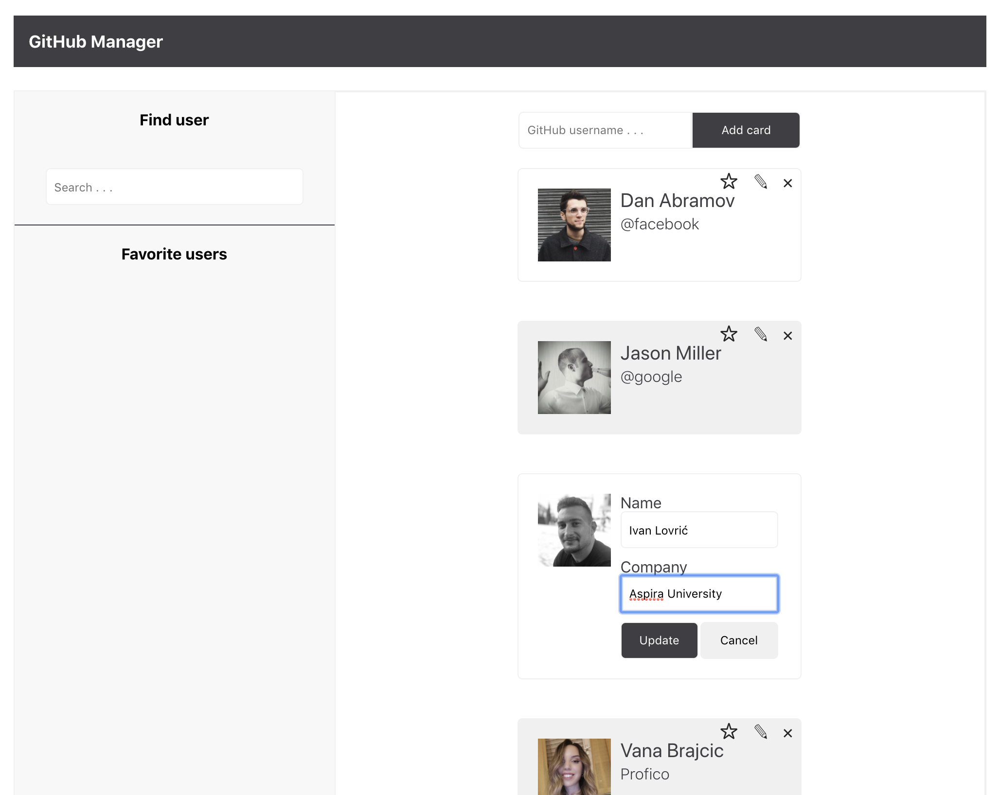

This project was bootstrapped with [Create React App](https://github.com/facebook/create-react-app).

# **React** #

GitHub Manager example.


## How to use ##
First, make sure you have **Node.js** (npm) installed.

### Clone the app

```
git clone https://github.com/ilovric00/aspira-spj-20.git
```

### Checkout to lection-4/task-2 branch

```
cd aspira-spj-20
git checkout lection-4/task-2
```

### Run development server

```
npm install
npm start
```
Go to http://localhost:3000


To get started, edit `src/App.js` and save to reload.

## Demo


