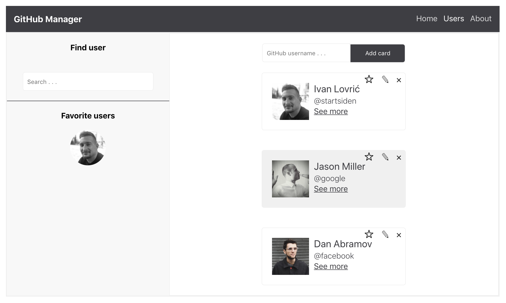

This project was bootstrapped with [Create React App](https://github.com/facebook/create-react-app).

# **React & Node/Express** #

GitHub Manager example.


## How to use ##
First, make sure you have **Node.js** (npm) installed.

### Clone the app

```
git clone https://github.com/ilovric00/aspira-spj-20.git
```

### Checkout to lection-12/task-1 branch

```
cd aspira-spj-20
git checkout lection-12/task-1
```

### Run development server

This runs both client and server using [Concurrently](https://www.npmjs.com/package/concurrently).

```
npm install
npm run dev
```
Go to http://localhost:3000

## Demo


